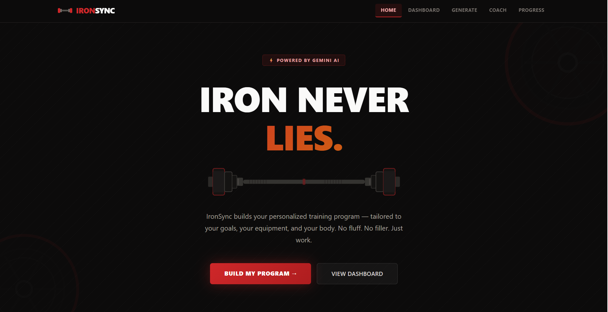
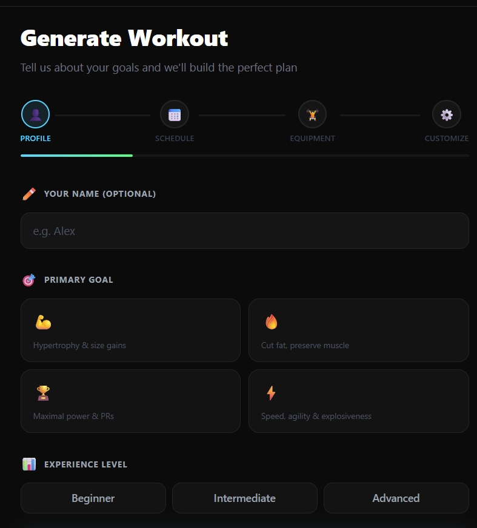
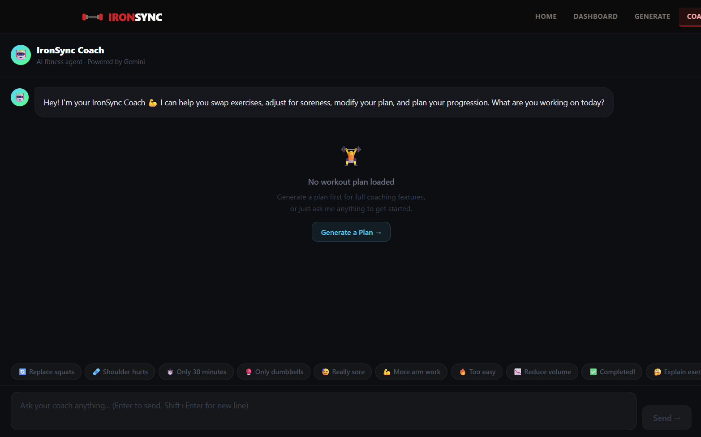

# IronSync

**Full-stack AI fitness agent** — generate personalized workout plans, chat with a multi-agent AI coach, and track your training progress.

**Live demo:** [iron-sync.vercel.app](https://iron-sync.vercel.app)

---

## Origin

IronSync started as two separate academic projects during my sophomore year at Iowa State University.

In **ENTSP 3100 (Entrepreneurship & Innovation)**, my group conducted a full feasibility assessment on the idea — validating the problem, sizing the market, and evaluating whether an AI-powered fitness agent was worth building.

In **MIS 3100 (Information Systems Analysis)**, I designed the system architecture and built Figma wireframes demonstrating how the platform would work end to end — user flows, data flows, and interface layouts.

After completing both courses, I decided to stop presenting the idea and actually build it. IronSync is the working MVP of what started on a whiteboard in those two classes.

---

## Features

- **Google Authentication** — Firebase Auth with Google sign-in; each user's data is isolated by UID
- **AI Workout Generator** — 4-step form generates a full weekly training program via Gemini AI
- **AI Coach Chat** — conversational interface with 4 specialized agents routing by intent
- **Exercise Swap Agent** — replaces exercises while preserving movement patterns
- **Recovery Agent** — modifies workouts around soreness, injury, or fatigue
- **Progression Agent** — prescribes specific load/rep increases based on completion
- **Progress Dashboard** — weekly streak tracker, muscle volume charts, and split balance analytics
- **Session Tracker** — log completed workouts stored in Firebase Firestore per user
- **JSON Validation Layer** — every AI response sanitized before reaching the frontend
- **Modular AI Provider** — swap between Gemini, Claude, or mock data with one env variable

---

## Tech Stack

| Layer | Technology |
|-------|-----------|
| Frontend | React 18, Vite, Tailwind CSS v4 |
| Backend | Node.js, Express |
| AI Provider | Gemini 2.5 Flash (Claude integration ready) |
| Auth | Firebase Authentication (Google sign-in) |
| Database | Firebase Firestore |
| Routing | React Router v6 |
| HTTP | Axios |

---

## Quick Start

### Prerequisites

- Node.js 18+
- A Gemini API key — free at [aistudio.google.com](https://aistudio.google.com) (optional — runs on mock data without one)

### 1. Clone the repo

```bash
git clone https://github.com/your-username/ironsync.git
cd "IronSync Project"
```

### 2. Backend

```bash
cd server
cp .env.example .env   # then edit .env to add your key
npm install
npm run dev            # starts on http://localhost:5000
```

### 3. Frontend

```bash
cd client
npm install
npm run dev            # starts on http://localhost:5173
```

Open **http://localhost:5173** in your browser.

---

## Environment Variables

Create `server/.env` from `server/.env.example`:

```env
PORT=5000
AI_PROVIDER=gemini          # "mock" | "gemini" | "claude"
GEMINI_API_KEY=your_key     # required when AI_PROVIDER=gemini
ANTHROPIC_API_KEY=          # for future Claude integration
```

Set `AI_PROVIDER=mock` to run the full app with no API key.

---

## API Reference

| Method | Endpoint | Description |
|--------|----------|-------------|
| GET | `/api/health` | Server health check |
| POST | `/api/ai/generate-workout` | Generate a workout plan |
| POST | `/api/coach/message` | Chat with AI coach |
| GET | `/api/workouts` | List saved workouts |
| POST | `/api/workouts` | Save a workout |
| DELETE | `/api/workouts/:id` | Delete a workout |

### `POST /api/ai/generate-workout`

**Body:**
```json
{
  "name": "Matt",
  "goal": "Build muscle",
  "experience": "Intermediate",
  "daysPerWeek": 4,
  "split": "Upper/Lower",
  "sessionLength": "60 min",
  "equipment": "Full gym",
  "trainingStyle": "Hypertrophy",
  "musclePriority": ["chest", "shoulders"],
  "musclesAvoid": [],
  "injuries": "",
  "notes": ""
}
```

**Response:**
```json
{
  "success": true,
  "workout": { "name": "...", "weeklySchedule": [...] },
  "warning": "optional — present when AI failed and mock data was used"
}
```

### `POST /api/coach/message`

**Body:**
```json
{
  "message": "I want to replace squats with something easier on my knees",
  "context": { "workout": {}, "goal": "Build muscle", "experience": "Intermediate" },
  "conversationHistory": [{ "role": "user", "content": "..." }]
}
```

**Response:**
```json
{
  "response": "Coach response text",
  "updatedWorkout": {},
  "reasoning": "Why these changes were made",
  "recommendations": ["Tip 1", "Tip 2"],
  "agentUsed": "swap"
}
```

---

## AI Architecture

IronSync routes messages to one of four specialized agents based on keyword intent detection:

| Agent | Trigger Keywords | Behavior |
|-------|----------------|----------|
| WorkoutAgent | (default) | General coaching, Q&A, volume modifications |
| ExerciseSwapAgent | replace, swap, only dumbbells | Substitute exercises by movement pattern |
| RecoveryAgent | sore, hurts, pain, injury | Modify workout for soreness or injury |
| ProgressionAgent | completed, next week, increase | Prescribe specific load/rep progressions |

All agents share the same Gemini interface. Switching to Claude requires only changing `AI_PROVIDER=claude` in `.env`.


---

## Project Structure

```
IronSync Project/
├── client/                          # React + Vite frontend
│   └── src/
│       ├── pages/
│       │   ├── LandingPage.jsx
│       │   ├── DashboardPage.jsx
│       │   ├── GenerateWorkoutPage.jsx
│       │   ├── WorkoutResultPage.jsx
│       │   ├── CoachPage.jsx
│       │   └── ProgressPage.jsx
│       └── components/
│           ├── Navbar.jsx
│           ├── WorkoutForm.jsx       # 4-step multi-step form
│           ├── WorkoutCard.jsx
│           └── MetricCard.jsx
│
├── server/                          # Express backend
│   ├── agents/
│   │   ├── WorkoutAgent.js
│   │   ├── ExerciseSwapAgent.js
│   │   ├── RecoveryAgent.js
│   │   └── ProgressionAgent.js
│   ├── routes/
│   │   ├── aiRoutes.js
│   │   ├── workoutRoutes.js
│   │   └── coachRoutes.js
│   ├── services/
│   │   ├── aiProvider.js            # Provider router (mock/gemini/claude)
│   │   ├── geminiService.js         # Gemini API wrapper
│   │   ├── claudeService.js         # Claude API stub
│   │   └── workoutPromptBuilder.js  # Prompt engineering
│   ├── utils/
│   │   └── validateResponse.js      # AI response validation + safe defaults
│   ├── server.js
│   └── .env.example
└── 
```

---

## Screenshots

### Home


### AI Workout Generator


### AI Coach


---

## Roadmap

- [x] Firebase Authentication (Google sign-in)
- [x] Firebase Firestore session tracking per user
- [x] Progress dashboard with charts and analytics
- [x] Mobile responsive layout
- [ ] Claude API integration (stub ready)
- [ ] Export workouts to PDF
- [ ] Mobile app (React Native)
